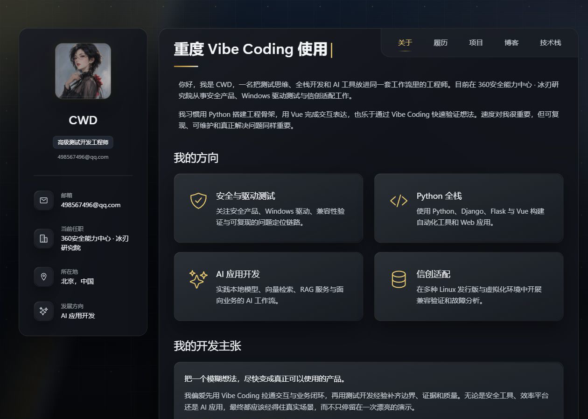
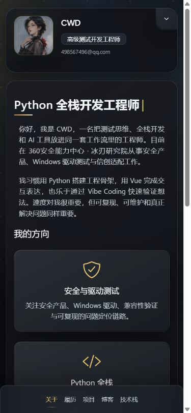

# CWD 个人博客

> CWD 的个人主页与中文技术博客，聚焦测试开发、Windows 安全测试、Python 全栈和 AI 应用开发。

[GitHub 仓库](https://github.com/CWDONG404/blog) · [CCN 技术赛事情报台](https://ccn.cwdzone.top/) · [2026 下半年成长路线图](https://plan.cwdzone.top/)

## 项目概览

项目由 Vue 3、TypeScript 和 Vite 构建，在参考原始 HTML 模板布局的基础上重新实现为组件化单页应用。视觉采用黑金银配色、冷色玻璃面板和 Harness 风格动态网格背景，同时保留桌面端粘性资料栏、内容卡片以及移动端底部导航。

站内内容均已替换为 CWD 的真实个人信息、技术方向、线上作品和中文技术文章，不包含模板中的虚构客户、评价、地图或联系表单。

## 页面截图

### 桌面端 · 1280 × 900



### 移动端 · 390 × 844



## 主要功能

- Vue Router Hash 路由，支持浏览器前进、后退、刷新和静态托管
- 中文个人介绍、履历、技术栈、作品列表和博客文章
- Markdown 文章渲染、桌面端文章目录、代码块与表格横向滚动
- 本地头像、项目截图和文章封面，不依赖远程占位素材
- 桌面端粘性个人资料栏，短视口下不会产生侧栏内部滚动条
- 移动端可折叠资料卡、固定五项底部导航和安全区适配
- 长标题、连续字符和正文内容防止页面级横向溢出
- 动态网格、金银环境光与扫描光效，并支持 `prefers-reduced-motion`
- 页面标题、描述和正式的中文 404 状态

## 页面路由

| 地址 | 页面 |
| --- | --- |
| `/#/` | 关于与个人方向 |
| `/#/resume` | 工作与教育履历 |
| `/#/portfolio` | 真实项目作品 |
| `/#/blog` | 博客文章列表 |
| `/#/blog/:slug` | Markdown 文章详情 |
| `/#/stack` | 分组技术栈与当前重点 |
| `/#/contact` | 自动跳转到技术栈页面 |

## 内置文章

- 《从测试开发到 AI 应用开发：一条工程化成长路径》
- 《在有限资源下搭建 RAG Web 服务：从文档解析到检索问答》
- 《驱动与安全产品兼容性测试：如何构建可复现的问题定位链路》

Markdown 源文件位于 `src/content/blog/`，新增文章时需同步维护文章元数据。

## 线上作品

- [CCN 技术赛事情报台](https://ccn.cwdzone.top/)：聚合计算机比赛、黑客松与职业证书信息。
- [2026 下半年成长路线图](https://plan.cwdzone.top/)：将长期目标拆解为领域、路线、里程碑与日常行动。

作品卡片会在新标签页直接打开线上站点，不建立虚构的项目详情或源码链接。

## 技术栈

- Vue 3.5 + TypeScript 6
- Vite 8 + Vue Router 4
- marked + DOMPurify
- Tailwind CSS 4 工具类 + 自定义 CSS 设计令牌
- Ionicons + 本地 Poppins 字体资源
- pnpm 11

## 本地运行

环境建议：Node.js 24、pnpm 11。

```bash
pnpm install
pnpm dev
```

默认开发地址由 Vite 输出，当前项目通常使用 `http://localhost:5173/`。

## 检查与构建

```bash
pnpm typecheck
pnpm build
pnpm preview
```

生产构建输出到 `dist/`。发布前建议同时检查 1280 × 900 桌面视口与 390 × 844 移动视口，确认导航、侧栏、文章目录和页面横向溢出状态正常。

## 目录说明

```text
src/
├─ assets/          # 头像、项目截图与本地静态素材
├─ components/      # 个人资料栏与全站导航
├─ content/blog/    # Markdown 博客正文
├─ data/            # 文章元数据及页面数据
├─ views/           # 关于、履历、项目、博客与技术栈页面
├─ router.ts        # Hash 路由与页面元信息
└─ style.css        # 设计令牌、响应式布局与背景动效
```

## 设计说明

页面结构参考 `portfolio-webpage-example` 的侧栏与内容面板形式，并以 Vue 组件重新实现。背景动效借鉴 DeepSeek Harness 的技术界面氛围，最终采用原创的黑金银视觉组合；本项目与上述产品或模板作者不存在官方关联。
