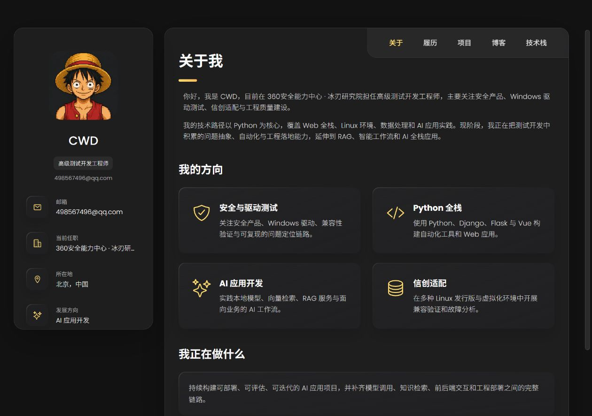
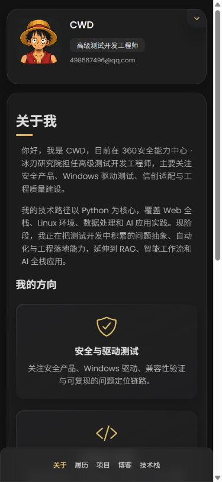

# CWD 个人博客

基于 Vue 3 与 TypeScript 实现的个人博客，完整保留参考模板的黑金视觉、卡片布局、桌面端粘性侧栏和移动端底部导航，并替换为 CWD 的真实个人信息、技术栈、作品与中文技术文章。

## 功能

- 中文个人介绍、履历与分组技术栈
- Vue Router Hash 路由，支持静态部署与页面刷新
- Markdown 博客列表和文章详情页
- CCN 技术赛事情报台、2026 下半年成长路线图作品入口
- 桌面端双栏布局和移动端折叠资料卡
- 移动端安全区适配、长内容防溢出和减少动态效果支持

## 技术栈

- Vue 3
- TypeScript
- Vite
- Vue Router
- marked
- DOMPurify

## 本地开发

```bash
pnpm install
pnpm dev
```

类型检查与生产构建：

```bash
pnpm typecheck
pnpm build
```

## 页面路由

- `/#/`：关于
- `/#/resume`：履历
- `/#/portfolio`：作品
- `/#/blog`：博客
- `/#/blog/:slug`：文章详情
- `/#/stack`：技术栈

## 页面截图

### 桌面端



### 移动端


